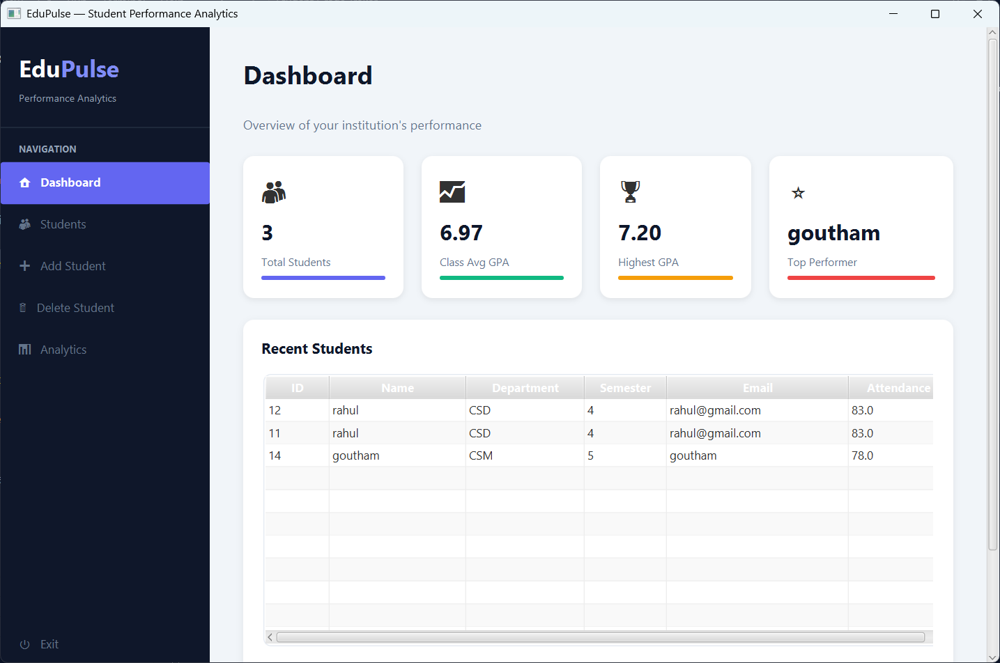
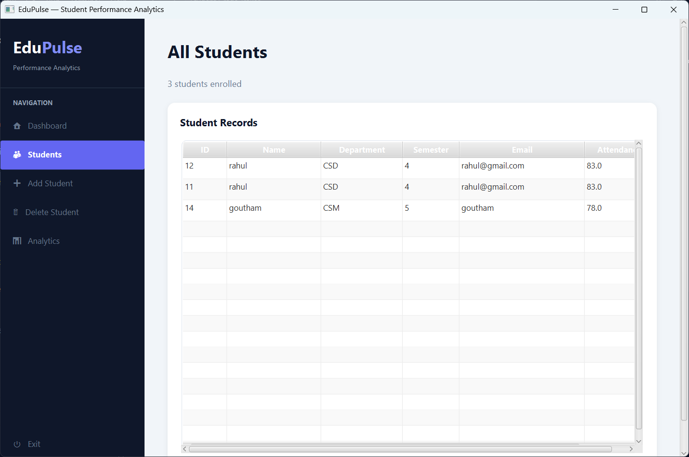
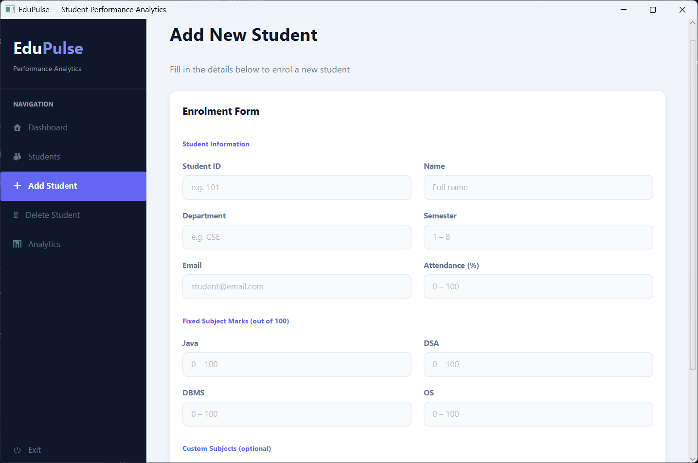
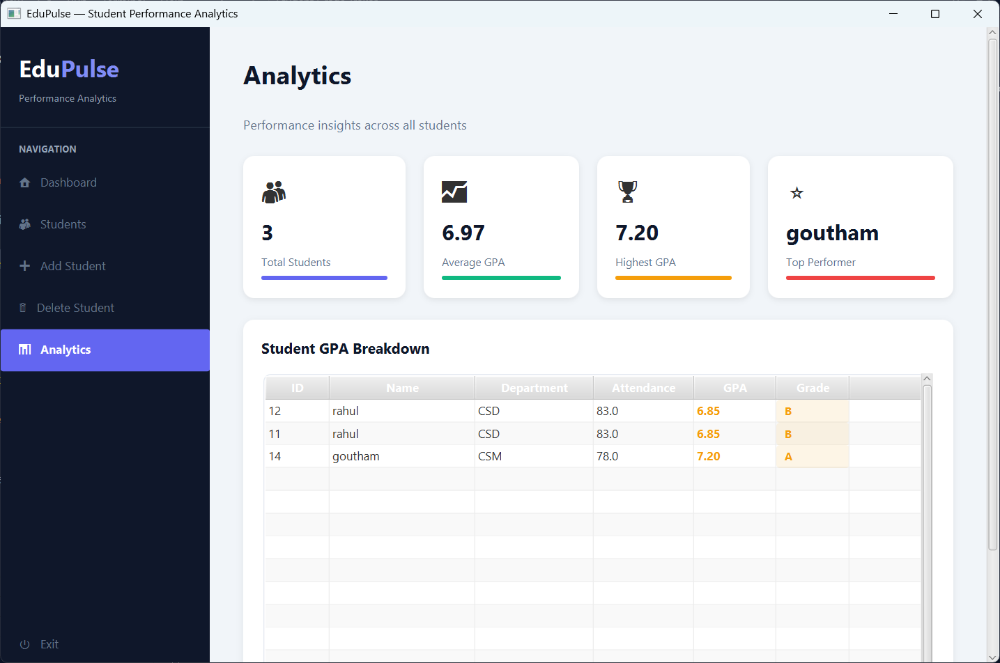

# EduPulse - Student Performance Analytics System


## Overview

EduPulse is a desktop-based Student Performance Analytics System developed using Java, JavaFX, Maven, and Object-Oriented Programming principles.

The application enables institutions to manage student records, track academic performance, calculate GPA, generate analytics, and maintain persistent student data through an intuitive graphical interface.

---

## Features

### Student Management
- Add New Students
- View Student Records
- Delete Student Records
- Search Students by ID

### Academic Analytics
- GPA Calculation
- Grade Generation
- Class Average GPA
- Highest GPA Analysis
- Top Performer Identification

### Subject Management
- Fixed Subjects (Java, DSA, DBMS, OS)
- Custom Subject Support
- Dynamic GPA Calculation

### Data Persistence
- Save Student Records to File
- Load Student Data Automatically on Startup

### GUI Dashboard
- Modern Sidebar Navigation
- Dashboard Analytics Cards
- Student Table View
- Interactive Forms
- Analytics Dashboard

---

## Screenshots

### Dashboard



### Student Records



### Add Student



### Delete Student


### Analytics



---

## Technologies Used

- Java 21
- JavaFX
- Maven
- Object-Oriented Programming (OOP)
- Collections Framework
- File Handling
- Git & GitHub

---

## Project Structure

```text
src/main/java/com/abhiram/edupulse

├── analytics
│   └── AnalyticsService.java
│
├── gui
│   └── EduPulseApp.java
│
├── model
│   └── Student.java
│
├── service
│   └── StudentService.java
│
├── storage
│   └── FileStorageService.java
│
├── util
│   ├── GPAUtil.java
│   └── ReportGenerator.java
│
└── main
    └── Main.java
```

---

## Installation

### Clone Repository

```bash
git clone https://github.com/BitlaAbhiram/EduPulse.git
```

### Navigate to Project

```bash
cd EduPulse
```

### Run Application

```bash
mvn clean javafx:run
```

---

## Sample Analytics

The system calculates:

- Student GPA
- Class Average GPA
- Highest GPA
- Top Performer
- Grade Classification

Example:

| Student | GPA |
|----------|------|
| Rahul | 6.85 |
| Goutham | 7.20 |
| Abhiram | 8.90 |

---

## Future Enhancements

- MySQL Database Integration
- Spring Boot REST APIs
- Authentication & Authorization
- PDF Report Generation
- Charts and Visual Analytics
- Cloud Deployment

---

## Author

### Abhiram B

Aspiring Software Engineer | Java Developer | AI & ML Enthusiast

GitHub: https://github.com/BitlaAbhiram

---

## License

This project is developed for educational and portfolio purposes.